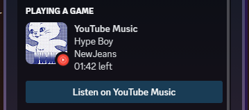

# YouTube Music Discord RPC



Discord Rich Presence for YouTube Music.

Consists of two components:

1. Web server that exposes an API to set/clear the presence.
2. Chrome/Edge extension that communicates with the web server.

## Installation

You need to install [Deno](https://deno.land) to run the web server.

Clone the repository:

```sh
git clone https://github.com/DjDeveloperr/ytmusic_rpc
cd ytmusic_rpc
```

### Web server

Run this command to start the web server from the root of the repository:

```sh
deno run -A --unstable server.ts
```

TODO: Add instructions for running the server as a service that starts on boot.

### Chrome/Edge extension

1. Open the Extension Management page by navigating to `chrome://extensions`.
2. Enable Developer Mode by clicking the toggle switch next to **Developer
   mode**.
3. Click the **LOAD UNPACKED** button and select the `extension` directory from
   the root of the repository.

## License

Apache 2.0-licensed. See the included [LICENSE](./LICENSE) file.

Copyright 2023 © DjDeveloperr
